## 🧑‍💻 Personal Website - Ramdan Prayitno

Ini adalah proyek website pribadi yang dibangun menggunakan **PHP**, **MySQL**, dan **Tailwind CSS**, dengan fitur lengkap untuk menampilkan informasi pribadi, galeri, dan artikel secara dinamis.

---

### 📌 Fitur-fitur

✅ **Dark Mode & Light Mode**

* Toggle tema dengan penyimpanan preferensi via `localStorage`.

✅ **Halaman Home**

* Hero section dengan efek ketik (typewriter).
* Responsive dan modern UI.

✅ **Halaman About**

* Menampilkan biodata dari database (`tbl_about`).
* Desain elegan + animasi scroll menggunakan AOS.
* Download CV dan ikon media sosial interaktif.

✅ **Halaman Gallery**

* Menampilkan foto dari database (`tbl_gallery`).
* Gambar bisa diklik, dengan efek hover dan transisi animasi saat scroll.

✅ **Halaman Artikel**

* Menampilkan daftar artikel dari database (`tbl_artikel`).
* Pencarian dan filter berdasarkan kategori.
* Artikel dengan ringkasan dan tombol "Baca Selengkapnya".
* Sidebar daftar artikel dengan link interaktif.

✅ **Panel Admin (PHP + MySQL)**

* Login admin.
* Tambah, edit, dan hapus artikel.
* Upload gambar ke galeri.
* Manajemen konten dinamis langsung dari backend.

---

### 🧹 Teknologi yang Digunakan

* PHP (Native)
* MySQL
* Tailwind CSS
* Font Awesome
* AOS (Animate On Scroll)
* JavaScript Vanilla

---

### 📸 Screenshot Tampilan

#### 🏠 Halaman Home (Typewriter Effect)

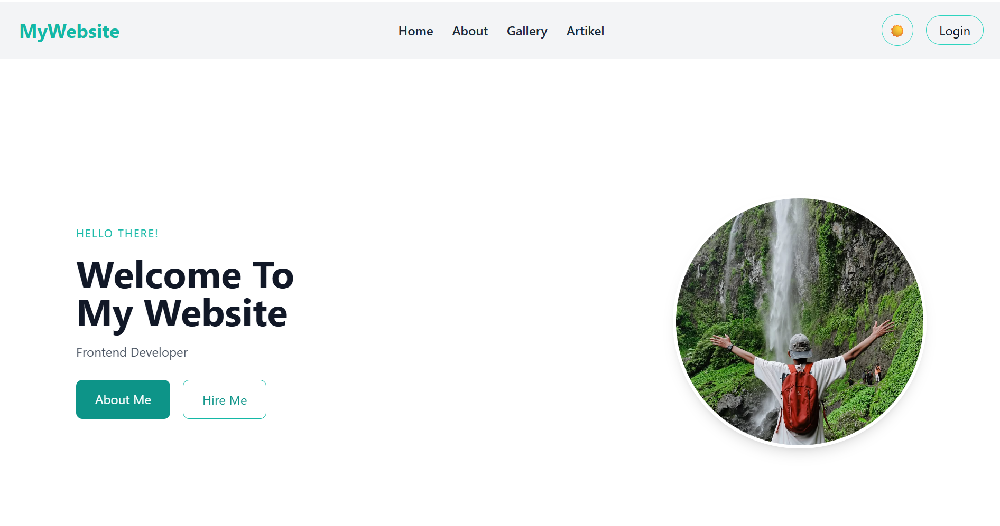
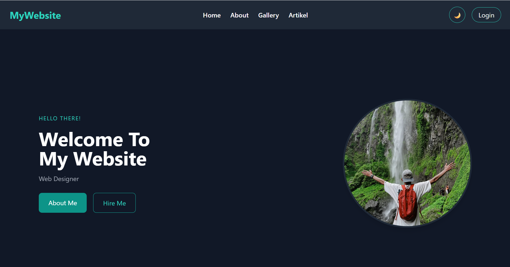

#### 🙋‍♂️ About Section

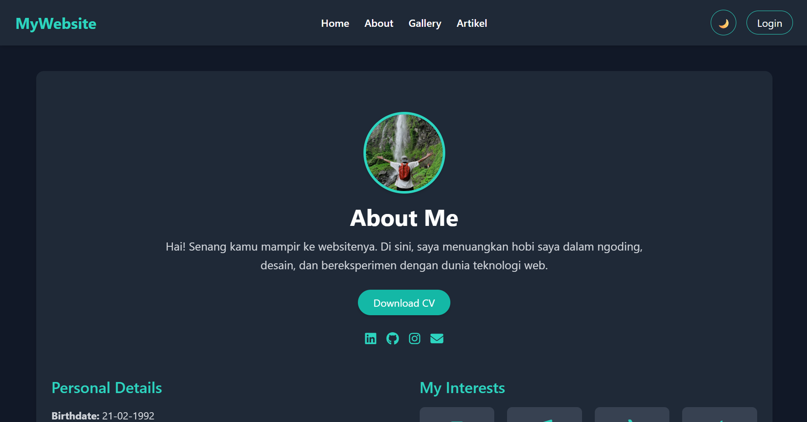

#### 🖼️ Gallery Page

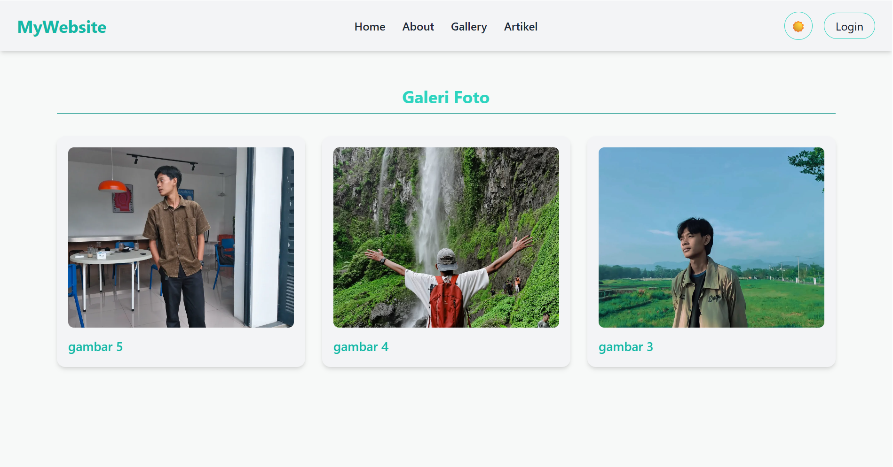
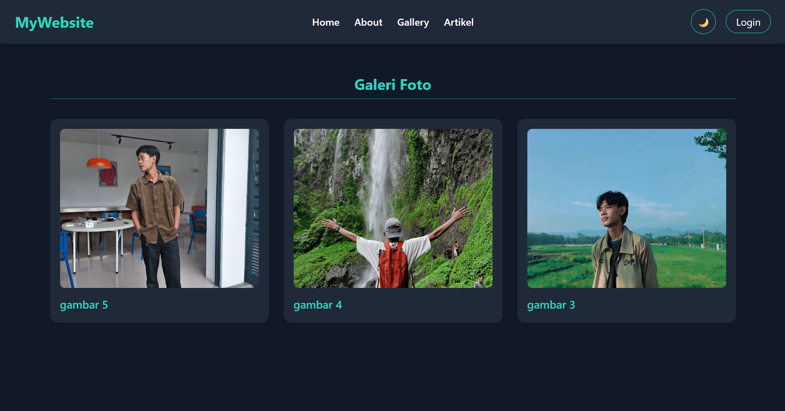

#### 📚 Artikel Page (dengan Pencarian & Filter)

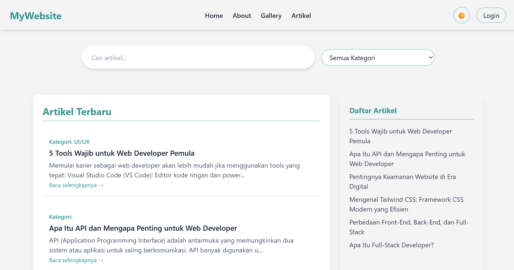
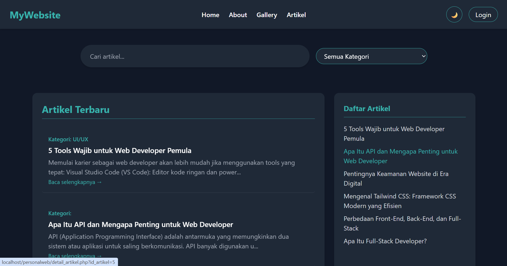

#### 🔐 Admin Panel (Login & Manajemen Artikel)

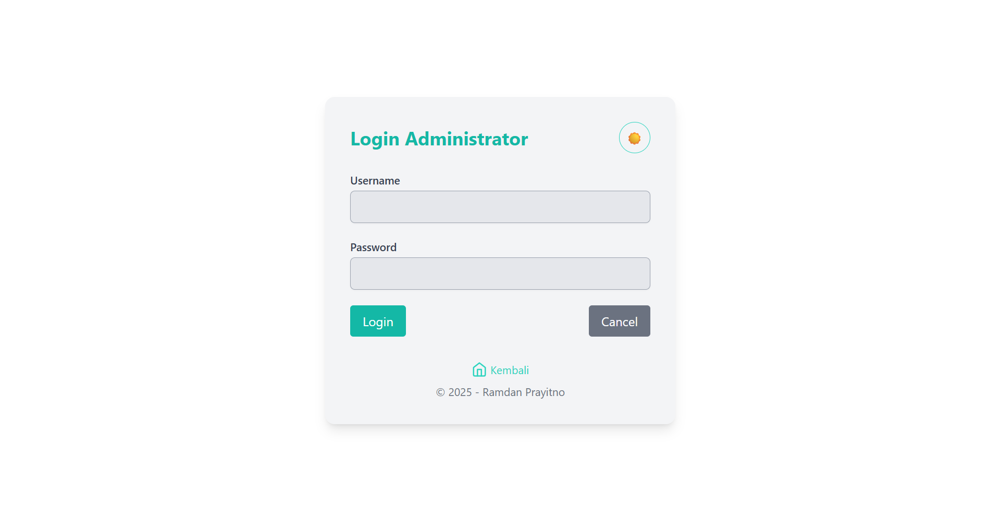
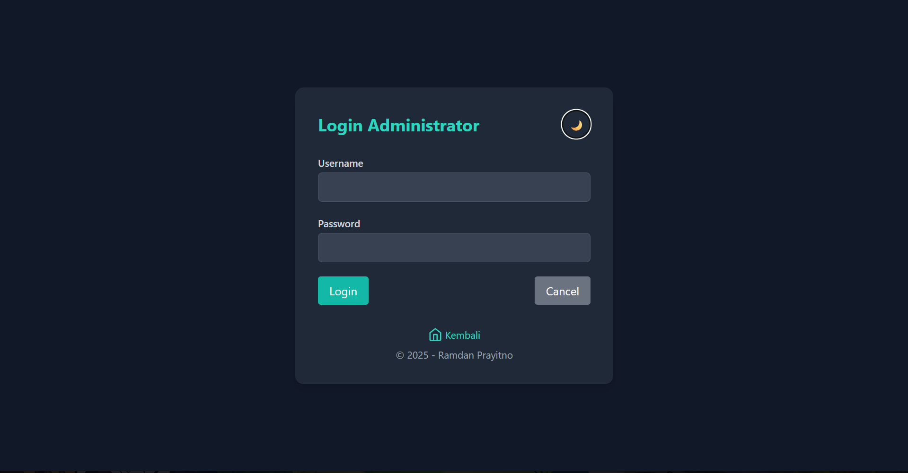
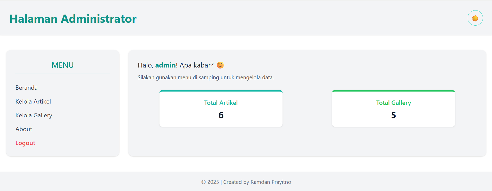
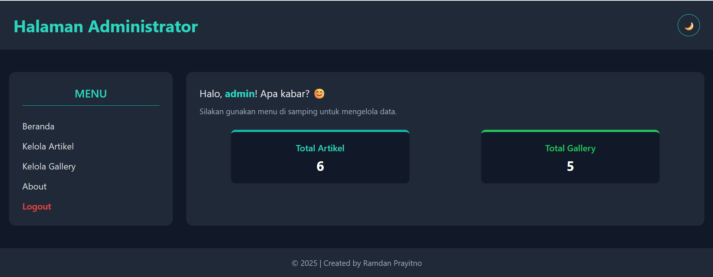

---

### 📂 Struktur Folder Utama

📦 project-root
├── admin/
│   ├── about.php
│   ├── add_about.php
│   ├── add_artikel.php
│   ├── add_gallery.php
│   ├── beranda_admin.php
│   ├── cek_login.php
│   ├── data_artikel.php
│   ├── data_gallery.php
│   ├── delete_about.php
│   ├── delete_artikel.php
│   ├── delete_gallery.php
│   ├── edit_about.php
│   ├── edit_artikel.php
│   ├── edit_gallery.php
│   ├── login.php
│   ├── logout.php
│   ├── proses_add_about.php
│   ├── proses_add_artikel.php
│   ├── proses_add_gallery.php
│   ├── proses_edit_about.php
│   ├── proses_edit_artikel.php
│   └── proses_edit_gallery.php
├── artikel.php
├── detail_artikel.php
├── about.php
├── gallery.php
├── home.php
├── koneksi.php
├── asset/
│   └── profil.webp
├── images/
│   └── (semua gambar galeri)
└── README.md

---

### ✍️ Penulis

**Ramdan Prayitno**
💼 UI/UX Enthusiast
